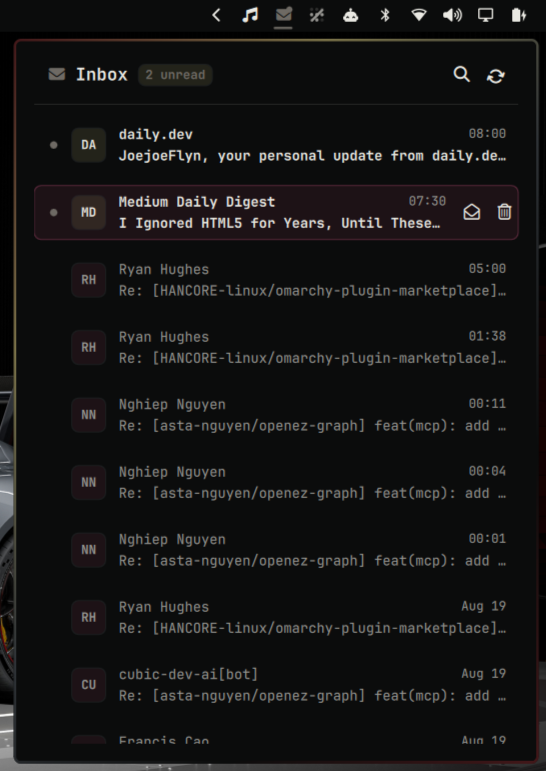

# ✉️ Omarmail

> A native status bar email widget and rich inbox reader for the [Omarchy](https://omarchy.org/) desktop shell.

[](https://omarchyplugins.com)
[](LICENSE)
[](https://github.com/pimalaya/himalaya)



---

## 🌟 Highlights

- **Native Omarchy Bar Widget**: Status bar envelope icon with real-time unread badges, status dots, and interactive tooltips.
- **Anchored Flyout Panel**: Anchored seamlessly below the status bar tray, matching first-party Omarchy panels (`tailscale`, `audio`, `network`).
- **Rich HTML Email Renderer**:
  - Full HTML & multi-part email rendering with formatted typography, headings, bullet lists, blockquotes, and tables.
  - Smart banner and logo image scaling with ultra-fast concurrent caching in `~/.cache/omarmail/images/`.
  - Monospace code block support for patch diffs, stack traces, and developer notifications.
  - Clickable external links that open directly in your default browser.
- **Fast Inbox Actions**:
  - Instant Mark as Read / Unread toggle without triggering detail view.
  - One-click deletion (Move to Trash).
  - Sender initials avatar bubbles and clean relative timestamps.
- **Live Search & Gmail Filter**:
  - Instant live fuzzy filtering by sender, email address, or subject.
  - Full IMAP query integration (`from:`, `to:`, `subject:`, `is:unread`, etc.).
- **Gmail Category Toggles**: Hide Promotions, Social, Updates, or Forums with one click from the inbox header.
- **Keyboard First Navigation**: Full navigation via keyboard shortcuts (`j`/`k`, `Enter`, `Escape`, `u`, `d`, `/`, `r`).

---

## 📥 Installation

Install directly using the Omarchy CLI:

```bash
omarchy plugin add https://github.com/JoeJoeflyn/omarmail
```

### Add to Status Bar

Add `"omarmail"` to your status bar section in `~/.config/omarchy/shell.json`:

```jsonc
{
  "bar": {
    "sections": {
      "right": [
        "omarmail",
        "omarchy.network",
        "omarchy.audio",
        "omarchy.battery"
      ]
    }
  }
}
```

---

## ⚡ Prerequisites

Omarmail is powered by [`himalaya`](https://github.com/pimalaya/himalaya) for IMAP and a **pinned** [`ortie`](https://github.com/pimalaya/ortie) release for Gmail OAuth. Use only the checksummed v2.2.0 assets below — not an unversioned remote installer.

### 1. Install Himalaya
```bash
omarchy pkg add himalaya
```

### 2. Install Ortie (Gmail OAuth only)

Download [ortie v2.2.0](https://github.com/pimalaya/ortie/releases/tag/v2.2.0), verify the SHA-256, then extract into `~/.local/bin`. Skip this if you use IMAP with password auth.

x86_64 Linux:

```bash
curl -sSL -o /tmp/ortie.tgz https://github.com/pimalaya/ortie/releases/download/v2.2.0/ortie.x86_64-linux.tgz
echo '526972ac0b98eac66c943058de350c668d594e0898c8c6bb2d1b0348fafcdb52  /tmp/ortie.tgz' | sha256sum -c
mkdir -p ~/.local/bin
tar -xzf /tmp/ortie.tgz -C ~/.local/bin
```

aarch64 Linux: use `ortie.aarch64-linux.tgz` with sha256 `667586c32ec3d087a40418014f286f0b8912001d32deef94edf668a634d898c6`.

### 3. Configure Your Mailbox
Create or configure `~/.config/himalaya/config.toml`:

```toml
[accounts.personal]
default = true
email = "you@example.com"
backend = "imap"
imap.host = "imap.example.com"
imap.port = 993
imap.login = "you@example.com"
imap.auth = "password" # or oauth2
```

---

## ⌨️ Keybindings & Controls

### Keyboard Shortcuts (within panel)

| Key | Action |
|---|---|
| `j` / `↓` | Move cursor down |
| `k` / `↑` | Move cursor up |
| `Enter` | Open selected email |
| `Escape` / `Backspace` | Back to inbox / close search / close panel |
| `u` | Toggle Read / Unread status |
| `d` | Move message to Trash |
| `/` or `s` | Focus search bar |
| `r` | Refresh inbox |

### Hyprland Global Hotkey
Bind a toggle hotkey in `~/.config/hypr/bindings.lua`:

```lua
-- Super + M to toggle Omarmail
o.bind("SUPER, M, exec, omarchy-shell omarmail toggle")
```

---

## 🔌 IPC Commands

Control Omarmail programmatically via `omarchy-shell`:

```bash
omarchy-shell omarmail open             # Open inbox popup
omarchy-shell omarmail toggle           # Toggle popup visibility
omarchy-shell omarmail refresh          # Sync latest emails
omarchy-shell omarmail openMessage <id> # Open specific email detail
```

---

## 📄 License

This project is licensed under the [MIT License](LICENSE).

---

## 🗑️ Removal

Uninstall the plugin and clean up cached data:

```bash
omarchy plugin remove omarmail
rm -rf ~/.cache/omarmail
rm -rf ~/.config/omarmail
```

Then remove `"omarmail"` from your status bar section in `~/.config/omarchy/shell.json`.
